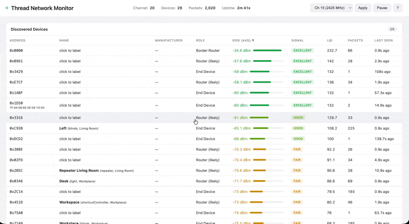

# Thread Network Monitor

A real-time web dashboard for monitoring Thread/Matter mesh networks (like IKEA Dirigera) using an nRF52840 USB sniffer dongle. Visualizes signal strength, link quality, and device relationships to help optimize device placement.

## Screenshot



## Features

- **Live signal monitoring** — RSSI and LQI per device, color-coded signal quality
- **Device identification** — Toggle mode to find which address belongs to which device
- **IKEA Dirigera integration** — Pair with the hub to import device names, types, and rooms
- **Manual labeling** — Click any device to assign a name, type, and room
- **Sortable device table** — Sort by address, name, signal strength, LQI, packets, or last seen
- **Signal analysis** — Automatic recommendations for weak links and repeater placement
- **Link tracking** — See which devices communicate and at what signal quality
- **Channel scanning** — Scan all 802.15.4 channels (11-26) to find your network
- **Wireshark integration** — Extcap plugin for deep packet analysis, auto-saved pcap files
- **Live packet feed** — Real-time view of all captured frames

## Hardware Required

- **[Nordic nRF52840 USB Dongle](https://amzn.to/4c75VhU)\*** (VID: 0x1915) — flashed with 802.15.4 sniffer firmware. This is the dongle this project was developed and tested with.
- A PC to run the dashboard (Windows or Linux)

\* *Amazon affiliate link. If you purchase through this link, it helps support the project at no extra cost to you.*

## Quick Start

### 1. Install dependencies

```bash
pip install pyserial flask requests
```

### 2. Flash the dongle

See `setup.ps1` for automated Windows setup, or manually:

```bash
# Download sniffer firmware from Nordic
# https://github.com/NordicSemiconductor/nRF-Sniffer-for-802.15.4

# Generate DFU package
nrfutil pkg generate --hw-version 52 --sd-req 0x00 \
  --application nrf802154_sniffer_nrf52840dongle.hex \
  --application-version 1 sniffer_fw.zip

# Press RESET button on dongle (LED pulses red), then flash
nrfutil dfu usb-serial -pkg sniffer_fw.zip -p COM_PORT
```

### 3. Find your network channel

```bash
python scan.py COM4  # Scans all channels, finds the most active one
```

### 4. Start the dashboard

```bash
python dashboard.py --port COM4 --channel 20 --hub-ip 192.168.1.100
```

Open http://localhost:8154 in your browser.

### Command line options

| Option | Default | Description |
|--------|---------|-------------|
| `--port` | COM3 | Serial port for the nRF52840 dongle |
| `--channel` | 15 | 802.15.4 channel (11-26) |
| `--host` | 0.0.0.0 | Dashboard listen address |
| `--web-port` | 8154 | Dashboard web port |
| `--hub-ip` | None | IKEA Dirigera hub IP for device name import |
| `--pcap` | auto | Save pcap capture to file (auto-named by timestamp) |

## Signal Strength Guide

| RSSI | Quality | Meaning |
|------|---------|---------|
| -30 to -60 dBm | Excellent | Strong, reliable connection |
| -60 to -70 dBm | Good | Solid connection |
| -70 to -80 dBm | Fair | Works but could be better |
| -80 to -90 dBm | Weak | Unreliable, consider a repeater |
| Below -90 dBm | Very Weak | Likely dropping packets |

## Device Identification

Thread devices appear as hex addresses (e.g. `0x2B5C`). Three ways to identify them:

1. **Dirigera Hub** — Pair with the hub, load device names, and assign them to Thread addresses
2. **Toggle Mode** — Snapshot the network, turn off a device, see which address disappears
3. **Manual** — Click any device row to label it yourself

## Files

| File | Description |
|------|-------------|
| `dashboard.py` | Web dashboard (Flask app with embedded HTML/JS) |
| `sniffer.py` | 802.15.4 packet capture and device tracking |
| `dirigera_client.py` | IKEA Dirigera hub API client (OAuth2 PKCE) |
| `scan.py` | Channel scanner — finds active 802.15.4 networks |
| `setup.ps1` | Windows setup script (installs Python, Wireshark, firmware) |

## Wireshark

The nRF Sniffer extcap plugin can be installed into Wireshark for deep packet analysis. Copy `nrf802154_sniffer.py` and `nrf802154_sniffer.bat` to Wireshark's extcap directory. The dashboard also saves `.pcap` files automatically.

## Auto-Identification Limitations

The "Auto-identify" and "Identify All" features work by blinking/toggling a device via the Dirigera hub and detecting which Thread address produces a traffic spike. This works well for most devices but has known limitations:

- **Nearby devices bleed traffic.** Thread is a mesh — when one device is toggled, its neighbors relay packets. Devices physically close together (e.g. 3 lights on one table) produce overlapping spikes, leading to misidentification.
- **Distant devices may not spike at all.** Devices far from the sniffer dongle communicate through routers. The sniffer may never see their direct radio transmissions — only the routers' relayed traffic.
- **Batch identification compounds errors.** "Identify All" assigns labels sequentially. If device A is mislabeled as address X, then device B (which is actually X) can never be matched, since X is filtered as "already assigned."
- **Blinds are especially tricky.** Their traffic patterns (small nudge commands) produce weaker spikes than lights toggling on/off.

**Recommendation:** After running "Identify All", verify the results by manually blinking individual devices and checking if the assigned address is the dominant spike. If a device can't be identified, check whether its address was already claimed by a mislabeled device.

For complex setups, give a local [Claude Code](https://claude.ai/code) instance access to the dashboard API — it can run systematic blink-and-compare tests across all devices to detect and resolve mislabeled addresses. See `AGENTS.md` for details.

## License

MIT
